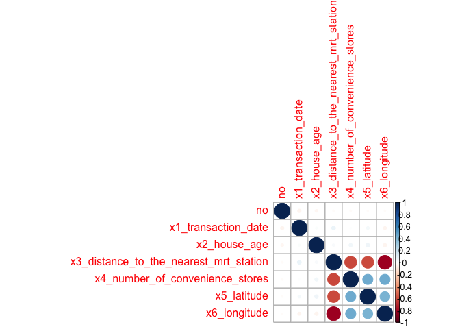

Untitled
================
Chirag Shah
2019-04-03

``` r
#loading libraries

library(caret)
```

    ## Loading required package: lattice

    ## Loading required package: ggplot2

``` r
library(readxl)
```

    ## Warning: package 'readxl' was built under R version 3.5.2

``` r
library(tidyverse)
```

    ## ── Attaching packages ─────────────────────────────────────────────────────── tidyverse 1.2.1 ──

    ## ✔ tibble  1.4.2     ✔ purrr   0.2.5
    ## ✔ tidyr   0.8.1     ✔ dplyr   0.7.6
    ## ✔ readr   1.1.1     ✔ stringr 1.3.1
    ## ✔ tibble  1.4.2     ✔ forcats 0.3.0

    ## ── Conflicts ────────────────────────────────────────────────────────── tidyverse_conflicts() ──
    ## ✖ dplyr::filter() masks stats::filter()
    ## ✖ dplyr::lag()    masks stats::lag()
    ## ✖ purrr::lift()   masks caret::lift()

``` r
library(glmnet)
```

    ## Loading required package: Matrix

    ## 
    ## Attaching package: 'Matrix'

    ## The following object is masked from 'package:tidyr':
    ## 
    ##     expand

    ## Loading required package: foreach

    ## 
    ## Attaching package: 'foreach'

    ## The following objects are masked from 'package:purrr':
    ## 
    ##     accumulate, when

    ## Loaded glmnet 2.0-16

``` r
library(ISLR)
library(corrplot)
```

    ## corrplot 0.84 loaded

``` r
library(splines)
library(mgcv)
```

    ## Loading required package: nlme

    ## 
    ## Attaching package: 'nlme'

    ## The following object is masked from 'package:dplyr':
    ## 
    ##     collapse

    ## This is mgcv 1.8-25. For overview type 'help("mgcv-package")'.

``` r
#Reading in the xlsx dataset

taipei_data <- read_excel("Real_estate_valuation_data_set.xlsx") %>%
  janitor::clean_names()
```

    ## readxl works best with a newer version of the tibble package.
    ## You currently have tibble v1.4.2.
    ## Falling back to column name repair from tibble <= v1.4.2.
    ## Message displays once per session.

``` r
data(taipei_data)
```

    ## Warning in data(taipei_data): data set 'taipei_data' not found

``` r
taipei_data <- na.omit(taipei_data)
x <- model.matrix(y_house_price_of_unit_area~. ,taipei_data)[,-1]
y <- taipei_data$y_house_price_of_unit_area

corrplot(cor(x))
```



``` r
theme1 <- trellis.par.get()
theme1$plot.symbol$col <- rgb(.2, .4, .2, .5)
theme1$plot.symbol$pch <- 16
theme1$plot.line$col <- rgb(.8, .1, .1, 1)
theme1$plot.line$lwd <- 2
theme1$strip.background$col <- rgb(.0, .2, .6, .2)
trellis.par.set(theme1)
featurePlot(x, y, plot = "scatter", labels = c("","Y"),
            type = c("p"), layout = c(4, 2))
```


``` r
#Partitioning the dataset
data(taipei_data)
```

    ## Warning in data(taipei_data): data set 'taipei_data' not found

``` r
## 75% of the sample size
smp_size <- floor(0.80 * nrow(taipei_data))

## set the seed to make your partition reproducible
set.seed(123)
train_taipei <- sample(seq_len(nrow(taipei_data)), size = smp_size)

train <- taipei_data[train_taipei, ]
test <- taipei_data[-train_taipei, ]
```

``` r
#Ridge Regression
ctrl1 <- trainControl(method = "repeatedcv", number = 10, repeats = 5)

set.seed(123)
ridge.fit <- train(x, y,
                     method = "glmnet",
                     tuneGrid = expand.grid(alpha = 0, 
                                            lambda = exp(seq(-1, 10, length = 100))),
                   # preProc = c("center", "scale"),
                     trControl = ctrl1)
```

    ## Warning in nominalTrainWorkflow(x = x, y = y, wts = weights, info =
    ## trainInfo, : There were missing values in resampled performance measures.

``` r
plot(ridge.fit, xTrans = function(x) log(x))
```


``` r
ridge.fit$bestTune
```

    ##   alpha    lambda
    ## 8     0 0.8007374

``` r
coef(ridge.fit$finalModel,ridge.fit$bestTune$lambda)
```

    ## 8 x 1 sparse Matrix of class "dgCMatrix"
    ##                                                    1
    ## (Intercept)                            -1.877291e+04
    ## no                                     -3.200411e-03
    ## x1_transaction_date                     4.661166e+00
    ## x2_house_age                           -2.527925e-01
    ## x3_distance_to_the_nearest_mrt_station -3.804119e-03
    ## x4_number_of_convenience_stores         1.121498e+00
    ## x5_latitude                             2.296386e+02
    ## x6_longitude                            3.042859e+01

``` r
#Lasso Regression
set.seed(123)
lasso.fit <- train(x, y,
                     method = "glmnet",
                     tuneGrid = expand.grid(alpha = 1, 
                                            lambda = exp(seq(-1, 5, length=100))),
                   # preProc = c("center", "scale"),
                     trControl = ctrl1)
```

    ## Warning in nominalTrainWorkflow(x = x, y = y, wts = weights, info =
    ## trainInfo, : There were missing values in resampled performance measures.

``` r
plot(lasso.fit, xTrans = function(x) log(x))
```


``` r
lasso.fit$bestTune
```

    ##   alpha    lambda
    ## 1     1 0.3678794

``` r
coef(lasso.fit$finalModel,lasso.fit$bestTune$lambda)
```

    ## 8 x 1 sparse Matrix of class "dgCMatrix"
    ##                                                    1
    ## (Intercept)                            -1.286282e+04
    ## no                                     -5.269912e-04
    ## x1_transaction_date                     3.801532e+00
    ## x2_house_age                           -2.350146e-01
    ## x3_distance_to_the_nearest_mrt_station -4.251481e-03
    ## x4_number_of_convenience_stores         1.062830e+00
    ## x5_latitude                             2.103516e+02
    ## x6_longitude                            .

``` r
#Linear Regression
set.seed(2)
lm.fit <- train(x, y,
                method = "lm",
                trControl = ctrl1)
```

``` r
###K-Nearest Neighbors fit
set.seed(123)
#Spliting data as training and test set. Using createDataPartition() function from caret
#indxTrain <- createDataPartition(y = re_data$house_price, p = 0.80, list = FALSE)
#training <- re_data[indxTrain,]
#testing <- re_data[-indxTrain,]
#dim(training); dim(testing);
#train: 332, 8
#test: 82, 8

trainX <- train[,names(train) != "y_house_price_of_unit_area"]
preProcValues <- preProcess(x = trainX,method = c("center", "scale"))
preProcValues
```

    ## Created from 331 samples and 7 variables
    ## 
    ## Pre-processing:
    ##   - centered (7)
    ##   - ignored (0)
    ##   - scaled (7)

``` r
set.seed(123)
trctrl <- trainControl(method = "repeatedcv", number = 10, repeats = 5)
knn_fit <- train(y_house_price_of_unit_area ~., data = train, method = "knn",
            trControl = trctrl,
            preProcess = c("center", "scale"),
            tuneLength = 10)
knn_fit
```

    ## k-Nearest Neighbors 
    ## 
    ## 331 samples
    ##   7 predictor
    ## 
    ## Pre-processing: centered (7), scaled (7) 
    ## Resampling: Cross-Validated (10 fold, repeated 5 times) 
    ## Summary of sample sizes: 297, 299, 298, 297, 299, 299, ... 
    ## Resampling results across tuning parameters:
    ## 
    ##   k   RMSE      Rsquared   MAE     
    ##    5  8.559411  0.6170369  5.984312
    ##    7  8.468955  0.6216830  5.929377
    ##    9  8.347221  0.6318043  5.835300
    ##   11  8.210785  0.6448178  5.738171
    ##   13  8.168376  0.6495206  5.728338
    ##   15  8.201815  0.6480252  5.751113
    ##   17  8.184509  0.6527244  5.746899
    ##   19  8.196880  0.6551225  5.722613
    ##   21  8.225152  0.6563743  5.752829
    ##   23  8.276560  0.6561397  5.799888
    ## 
    ## RMSE was used to select the optimal model using the smallest value.
    ## The final value used for the model was k = 13.

``` r
# Plot model error RMSE vs different values of k
ggplot(knn_fit)
```


``` r
# Best tuning parameter k that minimizes the RMSE
knn_fit$bestTune
```

    ##    k
    ## 5 13

``` r
# Make predictions on the test data
knn_predict <- knn_fit %>% predict(test)
# Compute the prediction error RMSE
RMSE(knn_predict, test$y_house_price_of_unit_area)
```

    ## [1] 8.298509

### GAM models

``` r
gam.m1 <- gam(y_house_price_of_unit_area ~ x1_transaction_date + x2_house_age + x3_distance_to_the_nearest_mrt_station + x4_number_of_convenience_stores + x5_latitude + x6_longitude, data = taipei_data)

gam.m2 <- gam(y_house_price_of_unit_area ~ x1_transaction_date + x2_house_age + s(x3_distance_to_the_nearest_mrt_station) + x4_number_of_convenience_stores + x5_latitude + x6_longitude, data = taipei_data)
#Spline term applied to distance to mrt station

gam.m3 <- gam(y_house_price_of_unit_area ~ x1_transaction_date + s(x2_house_age) + x3_distance_to_the_nearest_mrt_station + x4_number_of_convenience_stores + x5_latitude + x6_longitude, data = taipei_data)
#spline term applied to house age

gam.m4 <- gam(y_house_price_of_unit_area ~ x1_transaction_date + s(x2_house_age) + s(x3_distance_to_the_nearest_mrt_station) + x4_number_of_convenience_stores + x5_latitude + x6_longitude, data = taipei_data)
#Both house age and distance to mrt station are splined

anova(gam.m1, gam.m2, gam.m3, gam.m4, test = "F")
```

    ## Analysis of Deviance Table
    ## 
    ## Model 1: y_house_price_of_unit_area ~ x1_transaction_date + x2_house_age + 
    ##     x3_distance_to_the_nearest_mrt_station + x4_number_of_convenience_stores + 
    ##     x5_latitude + x6_longitude
    ## Model 2: y_house_price_of_unit_area ~ x1_transaction_date + x2_house_age + 
    ##     s(x3_distance_to_the_nearest_mrt_station) + x4_number_of_convenience_stores + 
    ##     x5_latitude + x6_longitude
    ## Model 3: y_house_price_of_unit_area ~ x1_transaction_date + s(x2_house_age) + 
    ##     x3_distance_to_the_nearest_mrt_station + x4_number_of_convenience_stores + 
    ##     x5_latitude + x6_longitude
    ## Model 4: y_house_price_of_unit_area ~ x1_transaction_date + s(x2_house_age) + 
    ##     s(x3_distance_to_the_nearest_mrt_station) + x4_number_of_convenience_stores + 
    ##     x5_latitude + x6_longitude
    ##   Resid. Df Resid. Dev      Df Deviance      F    Pr(>F)    
    ## 1    407.00      31931                                      
    ## 2    402.17      24791  4.8295   7140.1 25.515 < 2.2e-16 ***
    ## 3    403.93      29039 -1.7641  -4247.5 41.552 1.487e-15 ***
    ## 4    399.93      23273  4.0061   5766.0 24.839 < 2.2e-16 ***
    ## ---
    ## Signif. codes:  0 '***' 0.001 '**' 0.01 '*' 0.05 '.' 0.1 ' ' 1

``` r
summary(gam.m2)
```

    ## 
    ## Family: gaussian 
    ## Link function: identity 
    ## 
    ## Formula:
    ## y_house_price_of_unit_area ~ x1_transaction_date + x2_house_age + 
    ##     s(x3_distance_to_the_nearest_mrt_station) + x4_number_of_convenience_stores + 
    ##     x5_latitude + x6_longitude
    ## 
    ## Parametric coefficients:
    ##                                   Estimate Std. Error t value Pr(>|t|)    
    ## (Intercept)                     -2.390e+04  6.324e+03  -3.780 0.000181 ***
    ## x1_transaction_date              6.268e+00  1.385e+00   4.527 7.88e-06 ***
    ## x2_house_age                    -2.533e-01  3.546e-02  -7.144 4.27e-12 ***
    ## x4_number_of_convenience_stores  2.976e-01  1.902e-01   1.565 0.118446    
    ## x5_latitude                      2.897e+02  4.099e+01   7.068 6.95e-12 ***
    ## x6_longitude                     3.365e+01  4.527e+01   0.743 0.457748    
    ## ---
    ## Signif. codes:  0 '***' 0.001 '**' 0.01 '*' 0.05 '.' 0.1 ' ' 1
    ## 
    ## Approximate significance of smooth terms:
    ##                                             edf Ref.df     F p-value    
    ## s(x3_distance_to_the_nearest_mrt_station) 4.785  5.829 27.42  <2e-16 ***
    ## ---
    ## Signif. codes:  0 '***' 0.001 '**' 0.01 '*' 0.05 '.' 0.1 ' ' 1
    ## 
    ## R-sq.(adj) =  0.668   Deviance explained = 67.6%
    ## GCV = 63.129  Scale est. = 61.484    n = 414

``` r
summary(gam.m3)
```

    ## 
    ## Family: gaussian 
    ## Link function: identity 
    ## 
    ## Formula:
    ## y_house_price_of_unit_area ~ x1_transaction_date + s(x2_house_age) + 
    ##     x3_distance_to_the_nearest_mrt_station + x4_number_of_convenience_stores + 
    ##     x5_latitude + x6_longitude
    ## 
    ## Parametric coefficients:
    ##                                          Estimate Std. Error t value
    ## (Intercept)                            -1.615e+04  6.531e+03  -2.472
    ## x1_transaction_date                     5.489e+00  1.493e+00   3.677
    ## x3_distance_to_the_nearest_mrt_station -3.789e-03  6.979e-04  -5.429
    ## x4_number_of_convenience_stores         1.073e+00  1.822e-01   5.890
    ## x5_latitude                             2.353e+02  4.271e+01   5.508
    ## x6_longitude                           -6.092e+00  4.670e+01  -0.130
    ##                                        Pr(>|t|)    
    ## (Intercept)                            0.013839 *  
    ## x1_transaction_date                    0.000268 ***
    ## x3_distance_to_the_nearest_mrt_station 9.78e-08 ***
    ## x4_number_of_convenience_stores        8.13e-09 ***
    ## x5_latitude                            6.47e-08 ***
    ## x6_longitude                           0.896266    
    ## ---
    ## Signif. codes:  0 '***' 0.001 '**' 0.01 '*' 0.05 '.' 0.1 ' ' 1
    ## 
    ## Approximate significance of smooth terms:
    ##                  edf Ref.df     F p-value    
    ## s(x2_house_age) 3.26  4.065 22.18  <2e-16 ***
    ## ---
    ## Signif. codes:  0 '***' 0.001 '**' 0.01 '*' 0.05 '.' 0.1 ' ' 1
    ## 
    ## R-sq.(adj) =  0.612   Deviance explained =   62%
    ## GCV = 73.388  Scale est. = 71.747    n = 414

``` r
summary(gam.m4)
```

    ## 
    ## Family: gaussian 
    ## Link function: identity 
    ## 
    ## Formula:
    ## y_house_price_of_unit_area ~ x1_transaction_date + s(x2_house_age) + 
    ##     s(x3_distance_to_the_nearest_mrt_station) + x4_number_of_convenience_stores + 
    ##     x5_latitude + x6_longitude
    ## 
    ## Parametric coefficients:
    ##                                   Estimate Std. Error t value Pr(>|t|)    
    ## (Intercept)                     -23376.885   6132.634  -3.812  0.00016 ***
    ## x1_transaction_date                  6.370      1.346   4.733 3.07e-06 ***
    ## x4_number_of_convenience_stores      0.347      0.185   1.876  0.06138 .  
    ## x5_latitude                        289.301     39.732   7.281 1.76e-12 ***
    ## x6_longitude                        27.699     43.804   0.632  0.52753    
    ## ---
    ## Signif. codes:  0 '***' 0.001 '**' 0.01 '*' 0.05 '.' 0.1 ' ' 1
    ## 
    ## Approximate significance of smooth terms:
    ##                                             edf Ref.df     F  p-value    
    ## s(x2_house_age)                           2.902  3.622 22.18 5.43e-15 ***
    ## s(x3_distance_to_the_nearest_mrt_station) 4.463  5.450 24.50  < 2e-16 ***
    ## ---
    ## Signif. codes:  0 '***' 0.001 '**' 0.01 '*' 0.05 '.' 0.1 ' ' 1
    ## 
    ## R-sq.(adj) =  0.687   Deviance explained = 69.6%
    ## GCV = 59.729  Scale est. = 57.945    n = 414

``` r
#GAM M4 has best R^2 value
plot(gam.m2)
```


``` r
plot(gam.m3)
```


``` r
#Comparison using MSE
resamp <- resamples(list(lasso = lasso.fit, ridge = ridge.fit, lm = lm.fit, knn = knn_fit))
summary(resamp)
```

    ## 
    ## Call:
    ## summary.resamples(object = resamp)
    ## 
    ## Models: lasso, ridge, lm, knn 
    ## Number of resamples: 50 
    ## 
    ## MAE 
    ##           Min.  1st Qu.   Median     Mean  3rd Qu.     Max. NA's
    ## lasso 4.617223 5.703507 6.221639 6.233663 6.790031 8.575565    0
    ## ridge 4.561952 5.750735 6.240758 6.224599 6.812184 8.550401    0
    ## lm    3.917294 5.471084 6.007278 6.203730 6.974933 8.823904    0
    ## knn   3.684396 5.130634 5.497842 5.728338 6.206631 8.911189    0
    ## 
    ## RMSE 
    ##           Min.  1st Qu.   Median     Mean  3rd Qu.     Max. NA's
    ## lasso 6.055987 7.434086 8.411178 8.687599 9.279069 15.36457    0
    ## ridge 5.935987 7.420169 8.276115 8.673681 9.213375 15.32214    0
    ## lm    5.086286 6.935952 7.953521 8.620284 9.560915 15.09535    0
    ## knn   4.842606 6.562376 7.680881 8.168376 8.485346 16.40705    0
    ## 
    ## Rsquared 
    ##            Min.   1st Qu.    Median      Mean   3rd Qu.      Max. NA's
    ## lasso 0.3098453 0.5622850 0.6081594 0.5990217 0.6724394 0.7952687    0
    ## ridge 0.3039642 0.5515677 0.6103156 0.5991655 0.6658882 0.7954177    0
    ## lm    0.2770081 0.5517515 0.6384528 0.6073372 0.6995824 0.8549363    0
    ## knn   0.2559488 0.6082626 0.6861830 0.6495206 0.7476793 0.8321240    0

``` r
parallelplot(resamp, metric = "RMSE")
```


``` r
bwplot(resamp, metric = "RMSE")
```


The best GAM Model has an R-Squared of: R-sq.(adj) = 0.687 The Lasso has an R-Squared of 0.599 The ridge has an R-Squared of 0.599 The linear model has an R -squared of 0.607 The KNN model has an r-squared of 0.650

because the Gam4 model (with 2 splines) has the best R-squared it is the preferred model. we should also take note of the RMSE of the other models to make the comparison. The GAM did not provide an RMSE so it cannot be used in the RMSE comparison.
